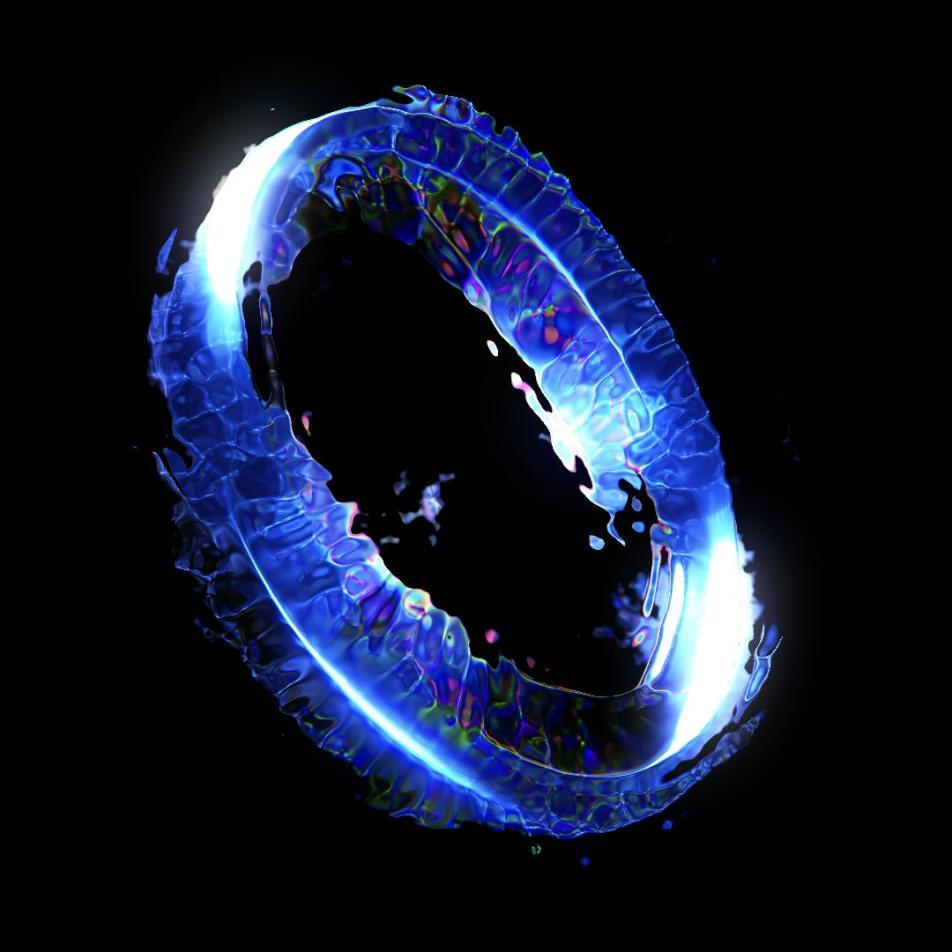

# SOS Genesis Membership NFT

The OpenDAO Genesis Membership NFT are tokens exclusively mintable by the $veSOS holders based on the snapshot taken on 18th Jan 2022.

Holding this token may entitle the owner access to airdrops, early access to future collections, early access to curated drops and various other benefits.

As an affirmation of $SOS believers, there are 4 tiers of membership NFTs.

Additional perks may apply to holders with a complete collection of all 4 NFTs.

### Tier 1 (veSOS balance > `1032988950.26`)
[Dynamic](./metadata/media/tier-1-disruptor.mp4)

### Tier 2 (veSOS balance > `289659300.26`)
[Dynamic](./metadata/media/tier-2-trajetory.mp4)

### Tier 3 (veSOS balance > `87818017.09`)
[Dynamic](./metadata/media/tier-3-singularity.mp4)

### Tier 4 (veSOS balance > `27303297.03`)
[Dynamic](./metadata/media/tier-4-newton-s-cradle.mp4)

